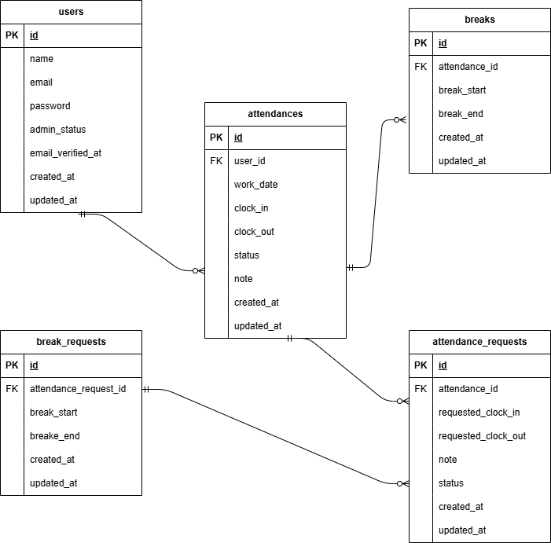

# furima

## Laravel環境構築

1. リポジトリをクローンする

```bash
git clone git@github.com:sugi3105/attendance-app.git
```

2. プロジェクトディレクトリへ移動する

```bash
cd attendance-app
```

3. Laravelパッケージをインストールする

```bash
docker run --rm -u "$(id -u):$(id -g)" -v "$(pwd):/var/www/html" -w /var/www/html \
  laravelsail/php82-composer:latest \
  composer install
```

4. `.env` ファイルを作成する

```bash
cp .env.example .env
```

5. `.env`に以下の環境変数を追加`

```env
DB_CONNECTION=mysql
DB_HOST=mysql
DB_PORT=3306
DB_DATABASE=laravel
DB_USERNAME=sail
DB_PASSWORD=password
```

6. コンテナの起動

```
 ./vendor/bin/sail up -d
```

7. アプリケーションキーの作成

```bash
./vendor/bin/sail artisan key:generate
```

8. マイグレーションの実行

```bash
./vendor/bin/sail artisan migrate --seed
```

9. フロントエンドパッケージのインストール

```
./vendor/bin/sail npm install
```

10. フロントエンドのビルドサーバーの起動

```
./vendor/bin/sail npm run dev
```

11. 実行確認

```bash
http://localhost/` へアクセスして動作確認をする
```

エラーが出て表示できない場合は、以下を実行してください

```bash
sudo chmod -R 777 ./src/*
```

12. テストプログラムの実行

```
./vendor/bin/sail artisan test
```

## 使用技術

- php8.3.0
- Laravel8.83.27
- MySQL8.0.26
- Docker
- Mailhog
- Stripe

## ER図



　

　

## URL

- 開発環境:http://localhost/
- phpMyAdmin: http://localhost:8080
- Mailhog: http://localhost:8025
